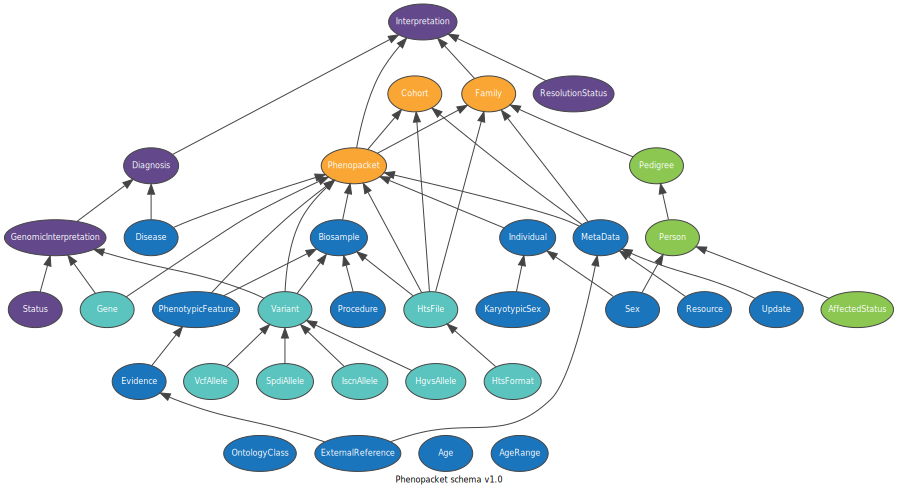
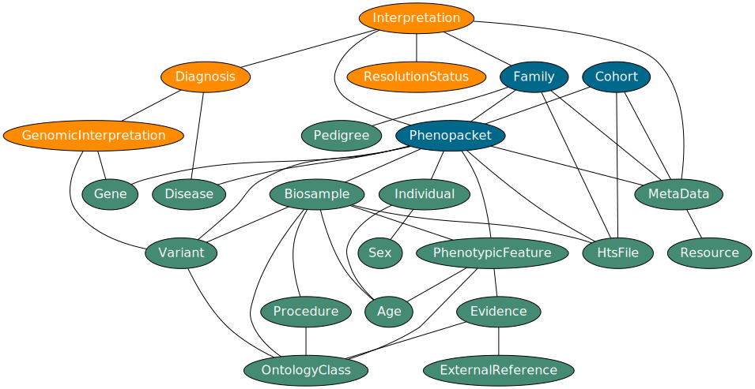
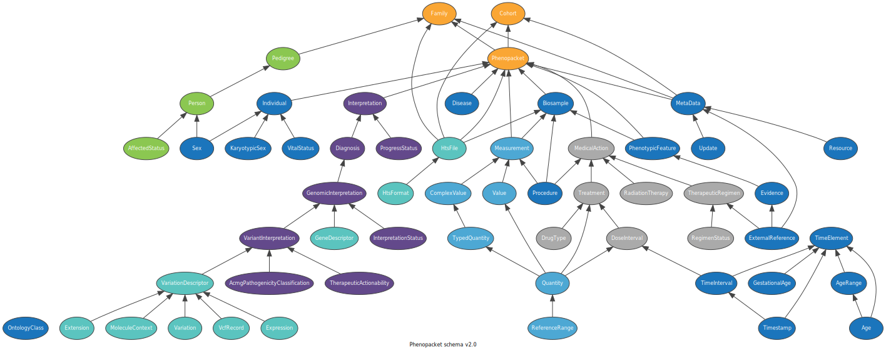
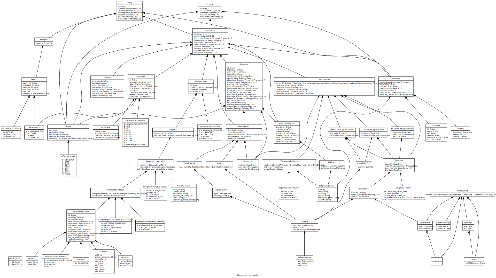

.. _rstschema:

##################
Phenopacket Schema
##################

The goal of the `phenopacket-schema <https://github.com/phenopackets/phenopacket-schema>`_ is to define a machine-readable
phenotypic description of a patient/sample in the context of rare disease, common/complex disease, or cancer. It aims to
provide sufficient and shareable information of the data outside of the EHR (Electronic Health Record) with the aim of
enabling capturing of sufficient structured data at the point of care by a clinician or clinical geneticist for sharing
with other labs or computational analysis of the data in clinical or research environments.

This work has been produced as part of the `GA4GH Clinical Phenotype Data Capture Workstream <https://ga4gh-cp.github.io/>`_ and is designed to
be compatible with `GA4GH metadata-schemas <https://github.com/ga4gh-metadata/metadata-schemas>`_.

The phenopacket schema defines a common, limited set of data types which may be composed into more specialised types for
data sharing between resources using an agreed upon common schema.

This common schema has been used to define the 'Phenopacket' which is a catch-all collection of data types, specifically
focused on representing disease data both initial data capture and analysis. The phenopacket schema is designed to be both human
and machine-readable, and to inter-operate with standards being developed in organizations such as in the `ISO TC215 committee <https://www.iso.org/committee/7546903.html>`_ and the `HL7 Fast Healthcare Interoperability Resources Specification (aka FHIR®) <http://hl7.org/fhir/>`_.

The structure of the schema is defined in `protobuf <https://developers.google.com/protocol-buffers>`_. You can find out more in the section :ref:`rstprotobuf`.

.. _phenopacket-schema-diagram:

Version 1.0
###########

The diagram below shows an overview of the schema elements.

.. role:: color-base
.. role:: color-interpretation
.. role:: color-measurement
.. role:: color-genomic-vrs
.. role:: color-pedigree
.. role:: color-top-level
.. role:: color-medical-action

   Overview of v1.0 of the schema. Lines between elements indicate composition. Note that the OntologyClass and TimeElement
   links have been omitted for legibility. The colour scheme represents: :color-base:`base classes`, :color-interpretation:`interpretation classes`,
   :color-genomic-vrs:`genomic classes`, :color-pedigree:`pedigree classes`, :color-top-level:`top-level classes`

   Detailed view of v1.0 of the schema. Lines between elements indicate composition. Note that the OntologyClass links have been
   omitted for legibility.

Version 2.0
###########

   Overview of v2.0 of the schema. Lines between elements indicate composition. Note that the OntologyClass and TimeElement
   links have been omitted for legibility. The colour scheme represents: :color-base:`base classes`, :color-interpretation:`interpretation classes`,
   :color-measurement:`measurement classes`, :color-genomic-vrs:`genomic/vrs classes`, :color-pedigree:`pedigree classes`,
   :color-top-level:`top-level classes`, :color-medical-action:`medical-action classes`

   Detailed view of v2.0 of the schema. Lines between elements indicate composition. Note that the OntologyClass and TimeElement
   links have been omitted for legibility.

Version 2.0 includes significant changes and additions to the model to enable better representation of cancer and common
disease, as well as catering for the original use-case for rare-disease.

Additions
~~~~~~~~~

The following elements and their sub-elements were added to the 2.0 schema. Other additional fields have been added
throughout the schema.

Measurements
------------

Added a new :ref:`rstmeasurement` message for capturing quantitative, ordinal (e.g., absent/present), or categorical
measurements. This element is available as a repeated field in the :ref:`rstphenopacket` and :ref:`rstbiosample`
top-level elements.

Medical actions
---------------

The :ref:`rstmedicalaction` was added to capture medications, procedures, other actions taken for clinical management.
This element is available as a repeated field in the :ref:`rstphenopacket`.

Time element
------------

The :ref:`rsttimeelement` was added to collect the various ways of expressing time or age throughout the schema. In
general where there was an `onset` or `start` time, a `resolution` or `end` :ref:`rsttimeelement` has been added.

VRS / VRSATILE
--------------

The :ref:`rstgene` and :ref:`rstvariant` replace the v1.0 ``Gene`` and ``Variant`` messages. The new messages are based on
the `VRS <https://vrs.ga4gh.org>`_  and `VRSATILE <https://vrsatile.readthedocs.io/en/latest/>`_ schemas defined by the
`GA4GH GKS group <https://ga4gh-gks.github.io/>`_

Non-breaking Changes
~~~~~~~~~~~~~~~~~~~~

The .proto files in the schema have been re-organised into more self-contained logical groups extracted from the `base.proto`
file. These files are all organised into a `v2` package which lives alongside the `v1` package. For some language bindings
it may be required to fix import paths for code created with the previous version to compile against the latest release,
but otherwise code using v1.0 of the schema should work identically.

Breaking Changes
~~~~~~~~~~~~~~~~

Time in Individual, Biosample, Disease, Phenotypic Feature
----------------------------------------------------------

The :ref:`rsttimeelement` replaces the onset `oneof` in :ref:`rstphenotypicfeature` and :ref:`rstdisease`, the `time_of_collection` field in
:ref:`rstbiosample`. The :ref:`rstindividual` `age` field has been replaced with a `time_at_encounter` :ref:`rsttimeelement`
and :ref:`rstbiosample` `individual_age_at_collection` has been replaced with a `time_of_collection` :ref:`rsttimeelement`.
:ref:`rstphenotypicfeature` 'negated' field was renamed to 'excluded' to be in line with :ref:`rstdisease` when indicating
an absent phenotype.

Gene and Variant contexts
-------------------------

In :ref:`rstphenopacket` and :ref:`rstbiosample` the `genes` and `variants` fields have been removed. In the case of the
:ref:`rstphenopacket` these have been replaced with the updated :ref:`rstinterpretation`.

Interpretation
--------------

The v2.0 :ref:`rstinterpretation` is now a sub-element of a `phenopacket`, rather than an enclosing element. The change
allows for better semantics on the ``Gene`` (now replaced by :ref:`rstgene`) and ``Variant`` (now replaced by :ref:`rstvariant`)
types and their relationship to an :ref:`rstindividual` or :ref:`rstbiosample` in the context of a :ref:`rstdiagnosis`
based on a :ref:`rstgenomicinterpretation`.